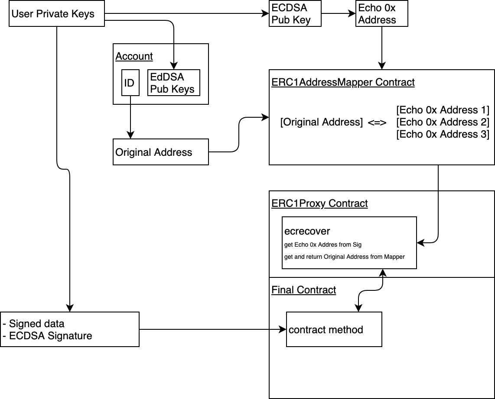

## Simple Summary

The `ecrecover` method override contract.

## Description of the problem

The solidity `ecrecover` method cannot be used in Echo EVM in the
version that is assumed by default.

There are three main reasons for this:

##### 1. EdDSA Instead Of ECDSA

Echo uses a different type of signature (EdDSA instead of ECDSA) which
does not support recovering a public key from a signature. Accordingly,
the mechanism cannot work by default, since `EcRecovery` returns the
address who signed the message, and it is impossible to get it from the
Echo signature

##### 2. Special Address Format

Addresses in Echo EVM is converted account ID. An account with id
`1.2.100` will have the address
`0x0000000000000000000000000000000000000064` which cannot be obtained
from the signature. For this reason, even if the ECDSA signature was
still supported, we would get problems comparing the sender address and
the address obtained from the signature. Accordingly, comparison and
validation (for which the `ecrecover` method is most often used) would
not work.

##### 3. Authority Mechanism

Since Echo supports an advanced mechanism for setting access rights to
an account, the private keys of the account can change

## Motivation

Minimize the changes necessary when transferring contracts from Ethereum
to Echo.

## Description of the proposal

The idea is to map the real address of the account and the ECDSA address
corresponding to the account private key. When calling the contract
method, which accepts the signature for subsequent verification, use the
ECDSA signature. Inside the contract, restore the address from the
signature and use the mapping to get the final address of the account.

## Specification

### General flow

- **Original Address** - the account address corresponding to the Echo
  EVM format. Example - `0x0000000000000000000000000000000000000064`
- **Echo 0x Address** - Ethereum format address corresponding to the
  account private key
- **ERC1AddressMapper Contract** - a predefined contract on the Echo
  network that stores the links between Original Address and Echo 0x
  Addresses

Before using the method that verifies the signature through `ecrecover`,
an account must send the transaction to `ERC1AddressMapper`, thereby
storing a connection between the original address and the Ethereum
address.

Next using the private key of the account, generate an ECDSA signature,
which will be sent to the contract as an argument.

The contract recovers the address from the signature and uses the mapper
to get the original address of the account.

### ERC1 Address Mapper Contract

### ERC1 Proxy Contract

### Example Of Usage

## Implementations

